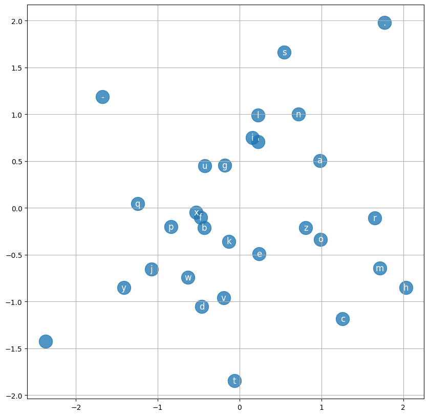

# AI ChatBots and LLMs

There are many definitions, but we will start with the following:

"An AI chatbot is an intelligent system composed of natural language processing components, machine learning, and knowledge base integration that enables dynamic, context-aware, and human-like conversations. It can understand, process, and generate human language, adapt to different interaction scenarios, and perform specific tasks such as answering queries, providing recommendations, or automating services."

In this course, we focus specifically on text-to-text AI ChatBots while recognizing the multimodal capabilities of contemporary ChatBots, such as those that can handle text, voice, and images.

The field of ChatBots dates back to the 1960s, and since then, huge advancements have been detected, especially in the last decade. Figure 1 depicts a timeline with some notable contributions in that field.


**Figure 1** Timeline with the origin of different chatbots (Source: Chakraborty, C. et al.,  Overview of Chatbots with special emphasis on artificial intelligence-enabled ChatGPT in medical science, Frontiers in Artificial Intelligence, Volume: 6-2023)

The first chatbots were restricted to performing only a limited pre-programmed response. So-called `rule-based chatbots` follow predefined rules in answering prepared questions, similar to the FAQs section. They are designed to respond to those questions, provide limited information, or guide users through specific tasks. Their minimal capabilities do not offer any flexibility, which often leads to blind street scenarios, frequently producing user dissatisfaction. 

On the other hand, AI Chatbots, or sometimes Conversational AI-driven Chatbots, refer to sophisticated technological solutions that enable computers (machines in general) to converse with humans or other machines using natural language. Advancements in various fields, such as NLP, ML, DL, database, and dialog management, led to the rapid development of AI chatbots that solved most of the shortcomings of rule-based chatbots and offered higher flexibility. The core features of conversational AI ChatBots are[^1]:

  - Understanding of Context: NLU systems comprehend the broader context of a conversation, processing words about the surrounding text or dialogue. 

  - Semantic Understanding: These systems grasp the meaning of words, including synonyms, slang, dialects, and jargon, often through entity recognition, allowing for a more nuanced understanding of user input.

  - Handling of Ambiguity: NLU systems can interpret vague or ambiguous expressions using contextual clues, inferring the most likely meaning based on the previous conversation.

  - Intent Recognition: NLU identifies the underlying intent of a user’s words, understanding what the user wants to accomplish, not just the literal meaning of the input.

  - Entity Recognition: The system identifies and categorizes specific named entities (like persons, locations, dates) within the text, enabling more precise interpretation.

  - Slot Filling: Extracts relevant information from user input (based on entity recognition) and places it into predefined slots for later use, such as booking a hotel or making an appointment.

  - Sentiment Analysis: NLU systems assess the emotional tone of a user’s input, determining whether they are happy, frustrated, or upset and adjusting the response accordingly.

  - Conversation Management: NLU systems track the history and flow of a conversation, managing interruptions, topic changes, and follow-up questions to create smoother, human-like interactions.

  - Multilingual Capability: Advanced NLU systems can understand and respond in multiple languages, enabling global communication and customer service.

  - Integration with External Systems: NLU systems can connect to external databases, CRMs, or APIs, allowing real-time data retrieval for more personalized and relevant responses.

AI Chatbots are utilized in various sectors, such as customer service, language translation, education, healthcare, banking, insurance, retail, and human resources. Most modern AI ChatBots are built around large language models (LLMs), and this course is interested in such systems. 

## Large Language Models (LLMs)

When Vaswani et al. published their paper "Attention is All You Need" in 2017, they never imagined the powerful impact of the proposed `Transformer` architecture. Firstly, their focus was only on machine translation, but transformer architecture with derivatives soon showed tremendous potential in many other tasks. It revolutionized natural language processing (NLP) because it can process text data efficiently, capture long-range dependencies in sentences, and work in parallel across sequences. This architecture uses self-attention and positional encoding to analyze relationships between words in a sentence, allowing it to understand context better than previous models. More broadly speaking, LLMs are part of generative AI systems. 

{: .box-note}
Generative AI refers to deep learning models that generate text, computer code, 3D simulations, images, audio, or video based on a large amount of representative training data.

Examples:

 - ChatGPT (text 	↦ text) [...](https://chat.openai.com/) → [openai.com](https://openai.com/)
 - Gemini (text 	↦ text) [...](https://gemini.google.com/app)
 - DALL·E 2 (text ↦ image)
 - DALL·E 3 (text ↦ image) `under chatGPT Plus`
 - Midjourney (text ↦ image) [...](https://www.midjourney.com/)
 - SORA (text ↦ video)[...](https://openai.com/sora)

 We can reach the DALL·E 3 model by using [bing → copilot](https://www.bing.com/new)

**Remark:** Many listed models are multimodal, and basic differences between unimodal and multimodal models are shown in figure 2.

 

**Figure 2** Unimodal vs Multimodalk Generative AI systems (Source: Cao, Y., Li, S., Liu, Y., Yan, Z., Dai, Y., Yu, P. S., & Sun, L. (2023). A comprehensive survey of ai-generated content (aigc): A history of generative ai from gan to chatgpt. arXiv preprint arXiv:2303.04226.)

Let us return to LLMs as generative AI systems that can forecast and generate the next most probable word following a sequence of words. We will explain that tokens, not words, are in play. A useful starting point for talking about tokenization is [Tiktokenizer web app](https://tiktokenizer.vercel.app/).

Figure 3 shows text in the app, while Figures 4 and 5 depict tokenization with a GPT2 tokenizer. 


**Figure 3** Input examples in GPT2 tokenizer


**Figure 4** Tokenization with GPT2 tokenizer of the textual part of the input 


**Figure 5** Tokenization of the input Python code using GPT2 tokenizer

Figure 6 shows that the token for the unique character `🅝` consists of three-byte values. The numerical part represents byte-coded values from the Byte Pair-encoding algorithm applied to UTF-8 byte-coded points of tokens. That algorithm is used for token representation compression. 


**Figure 6** Byte values for the Unicode character `🅝`

For further clarification, let's isolate just a short part of the text and print all code-point values of characters: 

```python
text = "Ｕｎｉｃｏｄｅ! 🅤🅝🅘🅒🅞🅓🅔‽ 🇺‌🇳‌🇮‌🇨‌🇴‌🇩‌🇪!"
print(f"Length of isolated part of the text: {len(text)}")
code_points = [ord(char) for char in text]
print(f"Code points:\n{code_points}")
```
Output would be:

```
Length of isolated part of the text: 32
Code points:
[65333, 65358, 65353, 65347, 65359, 65348, 65349, 33, 32, 127332, 127325, 127320, 127314, 127326, 127315, 127316, 8253, 32, 127482, 8204, 127475, 8204, 127470, 8204, 127464, 8204, 127476, 8204, 127465, 8204, 127466, 33]
```

Now, encode that in utf-8 as bytes:

```python
tokens_utf8 = list(text.encode('utf-8'))
print(f"Length of isolated part of the text encoded with utf-8: {len(tokens_utf8)}")
print(f"Byte representation of tokens encoded with utf-8:\n{tokens_utf8}")
```

Output:

```
Length of isolated part of the text encoded with utf-8: 102
Byte representation of tokens encoded with utf-8:
[239, 188, 181, 239, 189, 142, 239, 189, 137, 239, 189, 131, 239, 189, 143, 239, 189, 132, 239, 189, 133, 33, 32, 240, 159, 133, 164, 240, 159, 133, 157, 240, 159, 133, 152, 240, 159, 133, 146, 240, 159, 133, 158, 240, 159, 133, 147, 240, 159, 133, 148, 226, 128, 189, 32, 240, 159, 135, 186, 226, 128, 140, 240, 159, 135, 179, 226, 128, 140, 240, 159, 135, 174, 226, 128, 140, 240, 159, 135, 168, 226, 128, 140, 240, 159, 135, 180, 226, 128, 140, 240, 159, 135, 169, 226, 128, 140, 240, 159, 135, 170, 33]
```

We see that the length of encoded code points is larger than the number of code points. The reason is simple → simple characters e.g., `a` are encoded with one byte, while "complex characters", like `🅤` are encoded with up to 4 bytes. That is why we need to employ some compression → `Byte pair encoding algorithm`. In that process, many individual tokens are merged (analyze the output of Tiktokenizer for our examples, and that becomes obvious).  We will change the tokenizer to GPT-4o (Figure 7).


**Figure 7** Tokenization of the same examples with GPT-4o tokenizer

First, we can notice the total number of tokens differs → with the GPT2 tokenizer, it was 585, and with GPT-4o, it was 317. Close inspection shows that significant compression is mostly due to the improvement in block code tokenization in gpt-4o tokenizer (Figure 8):

|                                                        |                                                                 |
|:------------------------------------------------------:|:---------------------------------------------------------------:|
|  |  |
|                             (a)                        |                           (b)                                   |


**Figure 8** GPT2 tokenizer (a) has more fragmented tokenization of Python block codes compared to GPT-4o tokenizer (b)

The fragmentation of block codes in the GPT2 tokenizer is one of the main reasons GPT2 performed poorly in coding tasks compared to GPT-4o and other LLMs. 

As shown in the above examples, `tokenization` parses input text into meaningful constituent parts called `tokens`. Tokenization is the first step in presenting textual data to the computer for further processing. Besides efficient tokenization, we need a so-called `embedding` layer that consists of all tokens called `vocabulary`. Simplified, the embedding layer can be seen as a table with vocabulary tokens as rows and columns as components of multidimensional vector space. Vector space dimensionality, or embedding dimensionality, is hyper-parameter (e.g., 12288). The embedding layer is usually trained with LLM, so it starts with random values and ends with a meaningful representation of tokens in multidimensional space learned from the training dataset → for each token, there is a row in the embedding table that is a representation of the token in multidimensional vector space with numerical components. 

A good example is worth thousands of words, so we will present the described principles and generative process of LLMs in the case of generating new names from the input list of English names[^2].

Prerequisites (imports and loading data):

```python
import torch
import torch.nn.functional as F
import matplotlib.pyplot as plt

# load data
with open("names_eng.txt", encoding="utf-8") as fle:
    names = fle.readlines()
names = [name.strip().lower() for name in names]
print(names)
```
Here, for simplicity, we will consider each character as a token. Building vocabulary from input dataset:

```python
all_names = " ".join(names)
vocab = list(set(all_names))
vocab.sort()
vocab.insert(0, ".") #adding special character that denotes the start and end of the names
print(vocab)
```
Ensuring encoding characters to number and decoding back:

```python
ch2idx = {ch: k for k, ch in enumerate(vocab)}
idx2ch = {k: ch for k, ch in enumerate(vocab)}
print(ch2idx)
print(idx2ch)
```
Creating encoder and decoder:

```python
enc = lambda x: torch.tensor([ch2idx[ch] for ch in x], dtype=torch.long)
dec = lambda x: "".join([idx2ch[i.item()] for i in x])

# test encoder and decoder
test = "some string ok."
encoded = enc(test)
print(encoded)
decoded = dec(encoded)
print(decoded)
```
The goal is to obtain a dataset from which our model (MultiLayer Perceptron, MLP) can learn to generate new names. That can be done by presenting enough examples from which the model can learn the next most probable character to be predicted. This is known as context for prediction (generation). Our context will be three characters. 

```python
# encoding names into tensors of indices
block_size = 3 # three characters to predict the next one
X, Y = [], []

for name in names:
    # print(name)
    context = [0] * block_size
    for ch in name + ".":
        ix = ch2idx[ch]
        X.append(context)
        Y.append(ix)
        # print("".join([idx2ch[k] for k in context]), "-->", ch)
        context = context[1:] + [ix]
X = torch.tensor(X)
Y = torch.tensor(Y)

```
For taking only the first two names, the output of the above code (after removing comments) is: 

```
abagael
... --> a
..a --> b
.ab --> a
aba --> g
bag --> a
aga --> e
gae --> l
ael --> .
abagail
... --> a
..a --> b
.ab --> a
aba --> g
bag --> a
aga --> i
gai --> l
ail --> .
```
Ok, tokenization is resolved, and the embedding table is on track:

```python
# embedding lookup table/matrix
dims = 2 # embedding dimension -> hyper-parameter
C = torch.randn(len(vocab), dims)
C.shape
```

Model definition (MLP): 

```python
# defining all the paremeters of the model
num_neurons = 50
dims = 2
block_size = 3
gen = torch.Generator().manual_seed(3245327)
# lookup table
C = torch.randn(len(vocab), dims, generator=gen, requires_grad=True)
# hidden layer
W1 = torch.randn(dims * block_size, num_neurons, generator=gen, requires_grad=True)
b1 = torch.randn(num_neurons, generator=gen, requires_grad=True)
# output layer
W2 = torch.randn(num_neurons, len(vocab), generator=gen, requires_grad=True)
b2 = torch.randn(len(vocab), generator=gen, requires_grad=True)
# all parameters
parameters = [C, W1, b1, W2, b2]
# total number of parameters
total_params = sum([p.numel() for p in parameters])
print(f"Total number of parameters: {total_params}")
```
Initial embeddings are random, and we can show that by plotting in 2D (that is the reason why we decided to take dims = 2):

```python
# plot embeddings in 2D
plt.figure(figsize=(10,10))
plt.scatter(C[:,0].data, C[:,1].data, alpha=0.78, s=350)
for k in range(len(chars)):
    plt.text(C[k,0].item(), C[k,1].item(), chars[k], fontsize=12, ha="center", va="center",color="white")
plt.grid('minor')
```



**Figure 9** Random embeddings - all letters are scattered with no logical connections

Creating training, validation, and testing datasets:

```python
n1 = int(0.8 * len(X))
n2 = int(0.9 * len(X))
Xtr, Ytr = X[:n1], Y[:n1]
Xval, Yval = X[n1:n2], Y[n1:n2]
Xtest, Ytest = X[n2:], Y[n2:]

```

As we already learned, the training dataset is used for learning tasks, validation for model selection, tuning hyper-parameters, and testing datasets for model generalization evaluation. Here, we use validation in the role of the testing dataset. 

Training the model:

```python
# training the model
epochs = 3000 # hyper-parameter
lr = 0.1 # hyper-parameter
batch_size = 64 # hyper-parameter
losses = []
for epoch in range(epochs):
    # mini-batch gradient descent
    ix = torch.randint(0, len(Xtr), (batch_size,))
    # forward pass
    emb = C[Xtr[ix]]
    hid_out = torch.tanh(emb.view(-1, dims * block_size) @ W1 + b1)
    logits = hid_out @ W2 + b2
    # compute loss
    loss = F.cross_entropy(logits, Ytr[ix])
    losses.append(loss.item())
    # zero out gradients
    for par in parameters:
        par.grad = None
    # backward pass
    loss.backward()
    # update parameters
    for param in parameters:
        param.data -= lr * param.grad
    if epoch % (epochs // 20) == 0:
        print(f"Epoch {epoch} | loss {loss.item():.2f}")
```

[^1]: Adrian Thompson: ChatGPT for Conversational AI and ChatBots, Packt Publishing, 2024.
[^2]: Andrej Karpathy: [Building makemore Part 2: MLP](https://www.youtube.com/watch?v=TCH_1BHY58I&t=99s&ab_channel=AndrejKarpathy)
