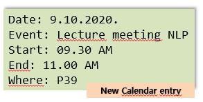
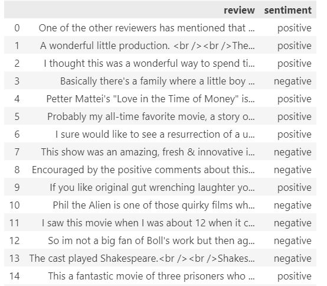
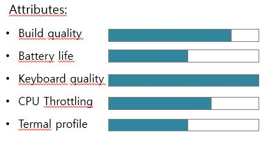
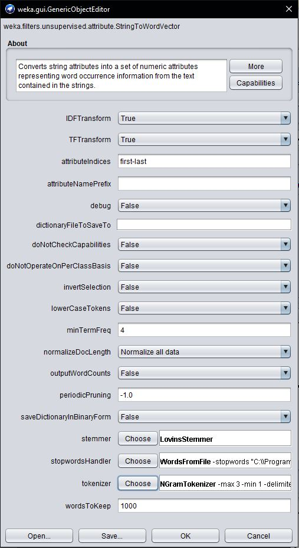
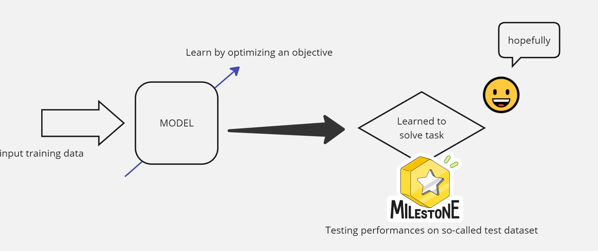
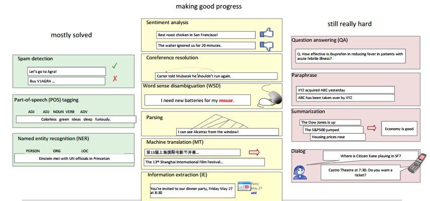
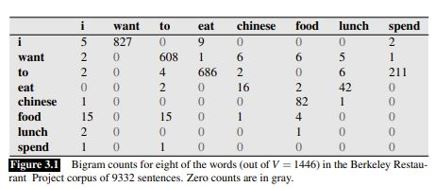
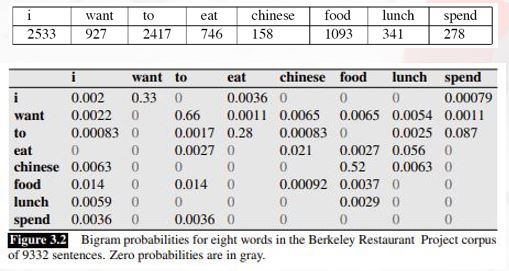
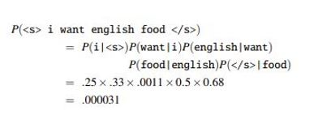
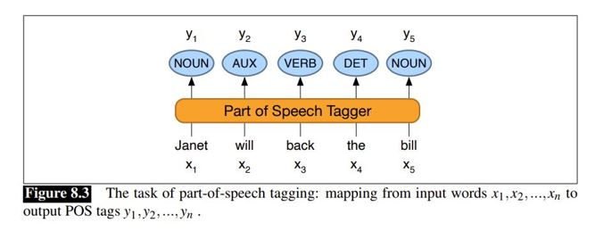

# Natural Language Processing (NLP)

> Why do we need NLP in AI ChatBots?

The heart of an AI chatbot is its ability to understand and process user inputs, typically in natural language (e.g., English, German, Croatian, etc.). Besides that, Natural Language Processing (NLP) 
have tools for chatbots to interpret, analyze, and generate human language, allowing them to interact with users effectively in a conversational manner.

> Natural Language Processing (NLP) is an interdisciplinary field that deals with different tasks performed by computers based on content derived from human language.

# Computer tasks in NLP

## 1. Question Answering 

(Jeopardy - won by IBM's Watson in 2011.)

## 2. Information extraction:

`The first lecture meeting for NLP will be on Monday, 9th of October, in P39, from 09.30 AM to 11.00 AM.`

&nbsp;



## 3. Sentiment Analysis (e.g. Movie Reviews)



The original dataset is from Kaggle [IMDB Dataset of 50K Movie Reviews](https://www.kaggle.com/datasets/lakshmi25npathi/imdb-dataset-of-50k-movie-reviews?resource=download&select=IMDB+Dataset.csv) and we will use it on `hands-on` afternoon session. 

In this NLP task, we usually have a human-generated opinion in text format, which can be classified as positive, negative, or neutral sentiment. Other types of sentiment analysis can encompass a wide range of nuances related to sentiment, but in most cases, the three-class analysis is the most common.


Attributes: build quality, battery life, keyboard quality, CPU throttling, thermal profile


By scaling attributes with the average rating value, we can obtain a more differentiated overview of each attribute's quality.   



Standard examples of sentiment analysis:

 - Movie reviews &rarr; positive, negative or neutral &Rarr; movie recommendations
 - Product comparisons &rarr; e.g., scaling attributes
 - Public sentiment &rarr; How is consumer confidence - is despair increasing? &Rarr; economy crisis prediction
 - Politics &rarr; what do people think about presidential candidates &Rarr; predicting election results
 - Market analysis &rarr; predicting market trends from customer opinions
   
Sentiment analysis has many other names:

 - **Opinion extraction**
 - **Opinion mining**
 - **Sentiment mining**
 - **Subjectivity analysis**

> In the context of AI ChatBots, in some chat scenarios, it is helpful to give the ChatBot an understanding of the user's emotional state and to learn how to respond appropriately. 

## 4. Machine translation

 - Google translate
 - Stanford's Phrasal
 - iTranslate
 - Microsoft Translator
 - DeepL Translator

There is a considerable effort in the NLP community to develop efficient and reliable helpers for human translators.

> For AI ChatBots there is sometimes a need to translate user inputs.


## 5. Text Classification

 - Spam detection
 - Classifying web pages
 - Classifying content of web pages
 - Classifying written works

> As pointed out, sentiment analysis is also a text classification task.

The main problem is that textual data can't be directly processed by computers &rarr; it requires some vectorization. The AI ChatBots and LLMs (Large Language Models) section will discuss this issue more deeply. Figures 1 and 3 show this, while Figure 2 depicts the preprocessing phase of text vectorization. 


**Figure 1** Raw text can not be processed directly (WEKA)



**Figure 2** Preprocessing raw text using `StringToWordVector` filter in WEKA


**Figure 3** Vectorized training data 

The process of text vectorization in a broader sense consists of several phases: tokenization, then N-gram detection according to the TF-IDF measure, stop-words removal, stemming, and lemmatization, which is part of the so-called text normalization process. Case folding is the most straightforward normalization process, and it can also be done. This represents NLP techniques used in various NLP tasks, and we will briefly discuss it later in this section. 

> IMPORTANT: In the context of LLMs, vectorization is used in a slightly different manner  

Now, we want to focus on classification as one of the major tasks in Machine Learning. Machine learning (ML), with the subfield of deep learning (DL), nowadays represents one of the most advanced fields of artificial intelligence (AI). Vastly simplified, the goal of ML and DL is to develop models that can solve some task (e.g., classification) by learning from data rather than algorithmically coding behavior to them (Figure 4).



**Figure 4** Simplified process of learning from data in ML and DL

The model learns from training data by changing its parameters in a broader sense because some objective function needs to be optimized (usually minimized). The independent test dataset evaluates how well the model has learned the task. The main goal is to get a model that performs well on training and test datasets, measured by some performance measure, or we say that it learned to generalize from data. The main problems that can not be avoided in such a process are `overfitting` or `underfitting.`

Overfitting occurs when the model performs too well on the training dataset but fails somewhat on the test dataset, and it is detectable through performance measures.
Underfitting is the opposite problem when the model underperforms on training and testing datasets no matter how many representative instances we collect for the training and testing phase. 

After we learn some fundamentals of ML and DL, the main fields in AI, we can proceed to a concrete example of text classification, one of the main tasks in NLP. Classification is the task in which a model needs to learn how to place a particular sample into the corresponding group with the known label. Domain experts usually specify the labels and need to have concrete semantic meanings. This type of learning in which input-output pairs are known for all instances in training/test datasets is called `supervised learning`. On the other hand, learning with known only inputs is called `unsupervised learning` (e.g., clustering). 

For demonstration, the text dataset [Tweets Dataset for Detection of Cyber-Trolls](https://www.kaggle.com/datasets/dataturks/dataset-for-detection-of-cybertrolls) from Kaggle is used. There are two classes, `Troll Tweets` and `Non-troll tweets`. We divided the vectorized original dataset in a 70% to 30% ratio for training and testing datasets. Three models were employed: Naive Bayes, KNN (K=3), and Random Forest. 

Results:

|Model|ACC|AUC|F-measure|
| :----- | ----: | ----: | ----------: |
|NB|52.658%|0.663|0.511|
|KNN (K=3)|71.371%|0.840|0.702|
|Random Forest|92.385%|0.962|0.924|

The Random forest model was chosen as the best model according to the evaluation measures in this experiment.
For now, we can conclude that NLP and ML (DL) or, in general, AI are closely connected! This will be more obvious when we introduce AI ChatBots and LLMs. 

Classification in NLP can also been generalized as follows:

 - **Classifying whole sentences:** Getting the sentiment of a review, detecting if an email is spam or not, classifying web content,  determining if a sentence is grammatically correct or whether two sentences are logically related or not
 - **Classifying each word in a sentence:** Identifying the grammatical component of a sentence (noun, verb, adjective &rarr; Part of Speach Tagging, POS), or the named entities (person, location, organisation &rarr; Named Entity Recognition, NER)

## 6. Paraphrasing

Org: Reading, after a certain age, diverts the mind too much from its creative pursuits. Any man who reads too much and uses his own brain too little falls into lazy habits of thinking. (Albert Einstein)

Par: To retain human innate creativity and productivity after a certain age, you need to be more willing to think rather than read too much.

## 7. Summarization

Org: The stock market is up this quarter, and overall trading exchange rose by 3%, while real estate demand skyrocketed.
Sum: The Economy is excellent!

Summarization and paraphrasing require some text generation. Text generation is a core task related to AI ChatBots. 

> **Important:** How hard are NLP tasks?



**Figure 5** Progress according to the difficulty of the problems in NLP (Prof. Dr. Siegfried Handschuh)

In essence, intuitively, we know that natural languages have many traps that make everyday communication, especially listed NLP tasks, very difficult. Here are some reasons why NLP have a hard time resolving problems related to natural languages:

1. Human language is abundant with ambiguity
2. Existence of idioms (e.g., get cold feet)
3. Slang language (e.g., Michael Jordan is the GOAT)
4. Nonstandard words (would-a, gonna, etc.)
5. Tricky names (Let it be was remastered in ....)
6. Nelogisms (retweet, bromance, etc.)
7. Segmentation issues (the Los Angeles Lakers-Clippers rivalry)
8. Dialects
9. Cultural context
10. Domain knowledge
11. Irony

The Probabilistic Language Model was one of the first successful approaches to coping with the abovementioned problems. The central premise in those models was that some words are more probable than others. 

> P(high winds tonite) > P(large winds tonite)

There is a more probable outcome for the particular sentence.

{: .box-success}
Models that assign probabilities to sentences or sequences of words are called Language Models (LM).

GOAL &rarr; Compute the probability of a sentence or sequence of words
P(W) = P(w1, w2, w3, …, wn)

Related task &rarr; probability of an upcoming word:
P(w5 | w1, w2, w3, w4)

It is more practical to observe sequences of N-words &rarr; N-grams.

 * 2 – gram  (bigram) &rarr;  "challenging times" , "this presentation"
 * 3 – gram (trigram) &rarr; "flip these books"

What are the challenges related to N-grams?
 * To calculate the probability of the N-gram
 * To calculate the probability of the last word in N-gram

The question is: How do we compute these probabilities?

TASK &rarr; compute P(w | h) &rarr; probability of a word w knowing some history h
`h = Economic lessons for the`
Candidate for `w = future`

P(future|Economic lessons for the) &rarr; abbrv. P(wd|seq)

Estimate probability from the very large corpus by counting relative frequencies.
  - Count the number of occurrences of the `seq` in the corpus
  - Count the number of times when `seq` is followed by `wd`	

There is so much counting, and with a handy approach known as the `chain rule,` estimating probabilities is again unpractical. But, N-grams offer solution &rarr; `instead of computing the probability of a word given its entire history, approximate the history by just the last few words`.

Bigram model &rarr; approximates the probability of a word given all the previous words by using only the conditional probability of the preceding word 𝑃(𝑊_𝑛│𝑊_(𝑛−1)).

Instead computing:
 P(the | Walden Pond’s water is so transparent that)
 
Approximate it with:
P(the | that)

In a bigram model, we are making this approximation:
𝑃(𝑊_𝑛│𝑊_1^(𝑛−1) )≈𝑃(𝑊_𝑛 |𝑊_(𝑛−1))

This assumption, by which the probability of a word only depends on the previous word, is known as the Markov[^1] assumption. 

> [!NOTE]
> Markov models are the class of probabilistic models that assume we can predict the probability of some future unit without looking too far into the past. We can generalize the bigram (which looks one word into the past) n-gram to the trigram (which looks two words into the past) and thus to the n-gram (which looks n−1 words into the past). (Jurafsky and Martin, Ch. 3 – p. 4)

Berkeley Restaurant Project – example from (Jurafsky and Martin[^2], Ch. 3):



Normalized values with unigrams occurrences.



Calculating probability:



Again, we agree that rules exist in every language that defines sentence construction mechanisms and related meanings. In the N-gram model, some order is preserved, but the semantical meaning generally is not. There are universal functions or roles of particular words or morphemes in languages:

```Nouns, verbs, adverbs, pronouns, prepositions, adverbs, articles, etc.```

Here, we are talking about `Part of Speech` because words can be classified based on the universal taxonomy of the speech/text. On the other hand, speech frequently brings some names into focus. Proper detection of names is an essential linguistic category.

 - Usually multiword phrase (e.g., Los Angeles, University of Zadar, Big Ben, …)

Any entity in the real or virtual world can be named! The problem of ambiguity:
 - Washington &rarr; Person? City? State? University?

Parts of speech (also known as POS) and named entities are valuable clues to sentence structure and meaning. Knowing whether a word is a noun or a verb tells us about likely neighboring words (nouns in English are preceded by determiners and adjectives, verbs by nouns) and syntactic structure (verbs have dependency links to nouns), making part-of-speech tagging an essential aspect of parsing. Emphasizing names gives a more relevant set of information - Named entity recognition (NER). Both approaches are important in answering questions, extracting information, translating, etc. &rarr; hand by hand processes in building understanding from speech/text.

**Part-of-speech tagging (POS Tagging)** &rarr; taking a sequence of words and assigning each word a part of speech like NOUN, VERB, ADVERB, … 

**Named entity recognition (NER)** &rarr; assigning words or phrases tags like PERSON, LOCATION, ORGANIZATION, …

Such tasks as assigning a label yi to each word xi in an input word sequence so that the output sequence Y has the same length as the input sequence X are called **sequence labeling tasks**.


**Figure 6** POS example from the book [^2]

Words are ambiguous &rarr; have more than one possible POS tag. For example, book can be a `verb` (***book*** that flight) or a `noun` (hand me that ***book***).


**Figure 7** Example of the NER process

The afternoon `hands-on` session will show more on POS and NER. 


[^1]: Andrey Andreyevich Markov (1856–1922) - famous Russian mathematician
[^2]: Daniel S. Jurafsky & James H. Martin: Speech and Language Processing: An Introduction to Natural Language Processing, Computational Linguistics, and Speech Recognition, Prentice Hall 2000.


